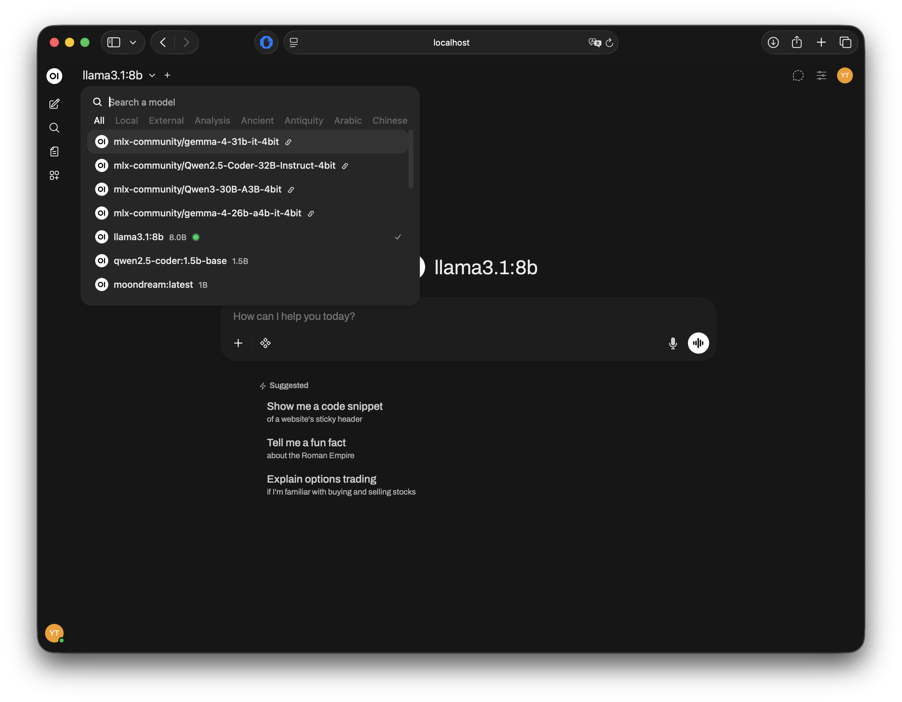
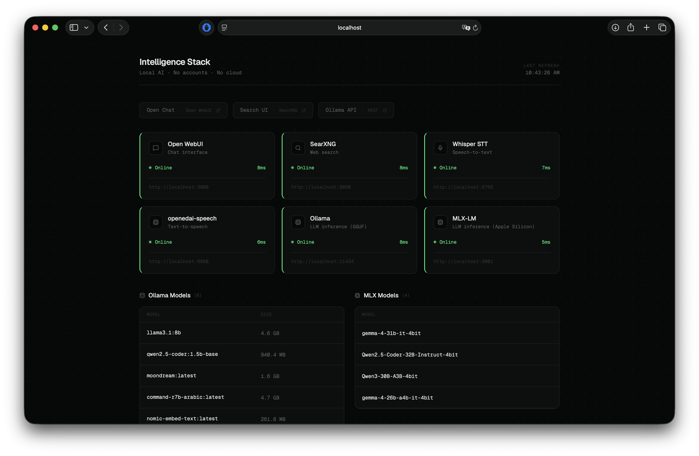
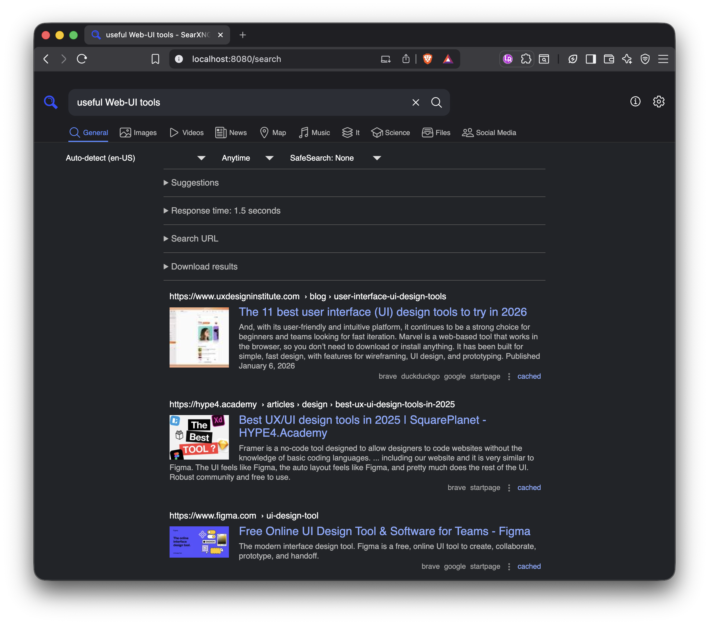
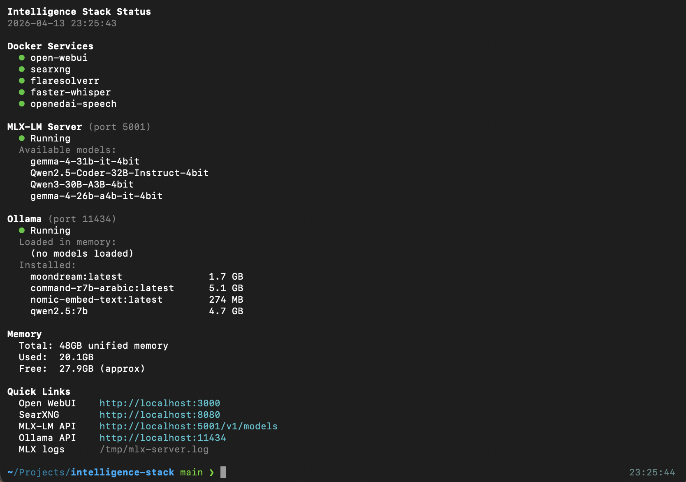

# Intelligence Stack

A fully self-hosted, offline-capable AI stack on Apple Silicon. No accounts, no cloud, no data leaving your machine.

## UIs

| Interface | URL | Purpose |
|-----------|-----|---------|
| **Open WebUI** | http://localhost:3000 | Chat, RAG, voice, web search |
| **Dashboard** | http://localhost:3001 | Service health + model browser |
| **SearXNG** | http://localhost:8080 | Search engine (direct access) |

## Screenshots

| | |
|---|---|
|  |  |
| **Open WebUI** — chat interface with all local models (Ollama + MLX) | **Dashboard** — live service health and model browser |
|  |  |
| **SearXNG** — self-hosted metasearch with category tabs | **`./status.sh`** — terminal health check |

---

## Architecture

```
Docker:
  Open WebUI (3000)  ----->  SearXNG (8080)  ----->  FlareSolverr (internal)
       |                         search engine         cloudflare bypass
       |
       +--->  Faster-Whisper (8765)    speech-to-text
       +--->  openedai-speech (8880)   text-to-speech

  Dashboard (3001)   health monitor for all services

Native on host:
  MLX-LM (5001)     Apple Silicon inference (OpenAI-compatible API)
  Ollama (11434)    GGUF models + embeddings
```

## Services

| Service | Purpose | Port |
|---------|---------|------|
| [Open WebUI](https://github.com/open-webui/open-webui) | Chat interface, RAG, tools | 3000 |
| Dashboard | Service health monitor + model browser | 3001 |
| [SearXNG](https://github.com/searxng/searxng) | Self-hosted metasearch (web grounding) | 8080 |
| [FlareSolverr](https://github.com/FlareSolverr/FlareSolverr) | Cloudflare bypass proxy for SearXNG | internal |
| [Faster-Whisper](https://github.com/fedirz/faster-whisper-server) | Local speech-to-text | 8765 |
| [openedai-speech](https://github.com/matatonic/openedai-speech) | Local Piper-based text-to-speech | 8880 |
| [MLX-LM](https://github.com/ml-explore/mlx-lm) | Apple Silicon optimized inference (OpenAI-compatible API) | 5001 |
| [Ollama](https://ollama.com) | GGUF model inference + embeddings | 11434 |

---

## Prerequisites

- macOS with Apple Silicon (M-series chip)
- [Docker Desktop](https://www.docker.com/products/docker-desktop/)
- [Ollama](https://ollama.com) installed natively
- Python 3.13+ with `mlx-lm` installed (`pip install mlx-lm`)

---

## Setup

```bash
# 1. Copy env file and generate your own keys
cp .env.example .env
# Edit .env — generate keys with: openssl rand -hex 32

# 2. Start Docker services
docker compose up -d

# 3. MLX-LM starts automatically via LaunchAgent
#    Manual start if needed: ./mlx-server.sh

# 4. Check everything
./status.sh
```

On first launch, open **http://localhost:3000** and create a local admin account. The dashboard is at **http://localhost:3001**.

---

## Web Search (SearXNG + Open WebUI)

SearXNG is a self-hosted metasearch engine that queries Brave, DuckDuckGo, Google, Bing, and others simultaneously and deduplicates the results. It runs entirely locally — no search query leaves your machine.

Open WebUI is wired directly to SearXNG via its internal Docker network (`searxng:8080`). When web search is active in a chat, Open WebUI sends the user's query to SearXNG's JSON API, injects the returned results into the model's context window, and the model answers with live web grounding.

**To use web search in a chat:**
1. Click the **+** icon in the message input bar
2. Toggle **Web Search** on
3. Ask anything — the model will search before answering and cite its sources

To enable web search by default for all chats: Admin Panel → Settings → Web Search → toggle on.

**Direct SearXNG access** at http://localhost:8080 gives you the full search UI with category tabs (General, Images, Videos, News, Science, Map) — useful for browsing results directly without going through a model.

---

## MLX-LM

MLX-LM runs as a native server on port 5001, providing an OpenAI-compatible API optimized for Apple Silicon. It dynamically swaps models based on the request — only one model is loaded in memory at a time.

Open WebUI connects to it as an OpenAI-compatible backend alongside Ollama. Both appear in the model selector — MLX models are prefixed with `mlx-community/`. Models are downloaded on first use and cached in `~/.cache/huggingface/hub/`.

Edit `mlx-server.sh` to change the default model or server options. The LaunchAgent starts the server automatically on login.

### Memory management

Apple Silicon uses unified memory shared between MLX and Ollama. Large models cannot run simultaneously. Ollama auto-unloads models after 5 minutes of inactivity (configured in `~/.ollama/config.json`). MoE (mixture-of-experts) models use significantly less memory than their parameter count suggests.

---

## Configuration

| File | Purpose |
|------|---------|
| `.env` | Secret keys (gitignored) |
| `.env.example` | Template for `.env` |
| `docker-compose.yml` | Docker service definitions |
| `searxng/settings.yml` | SearXNG engines, timeouts, proxy config |
| `mlx-server.sh` | MLX-LM server startup script |
| `status.sh` | Stack health dashboard |
| `pin-embeddings.sh` | Pins an Ollama embedding model in memory for RAG |

### LaunchAgents (auto-start on login)

| Plist | Purpose |
|-------|---------|
| `~/Library/LaunchAgents/com.intelligence-stack.mlx-server.plist` | MLX-LM server on port 5001 |
| `~/Library/LaunchAgents/com.intelligence-stack.pin-embeddings.plist` | Pin embedding model in Ollama |

---

## Commands

```bash
# Start/stop Docker services
docker compose up -d
docker compose down

# Stack status (all services, models, memory)
./status.sh

# Restart a single service
docker compose restart open-webui

# Tail logs
docker compose logs open-webui -f

# MLX-LM logs
tail -f /tmp/mlx-server.log

# Manually start/stop MLX-LM server
./mlx-server.sh
launchctl unload ~/Library/LaunchAgents/com.intelligence-stack.mlx-server.plist

# Update all Docker images
docker compose pull && docker compose up -d
```
