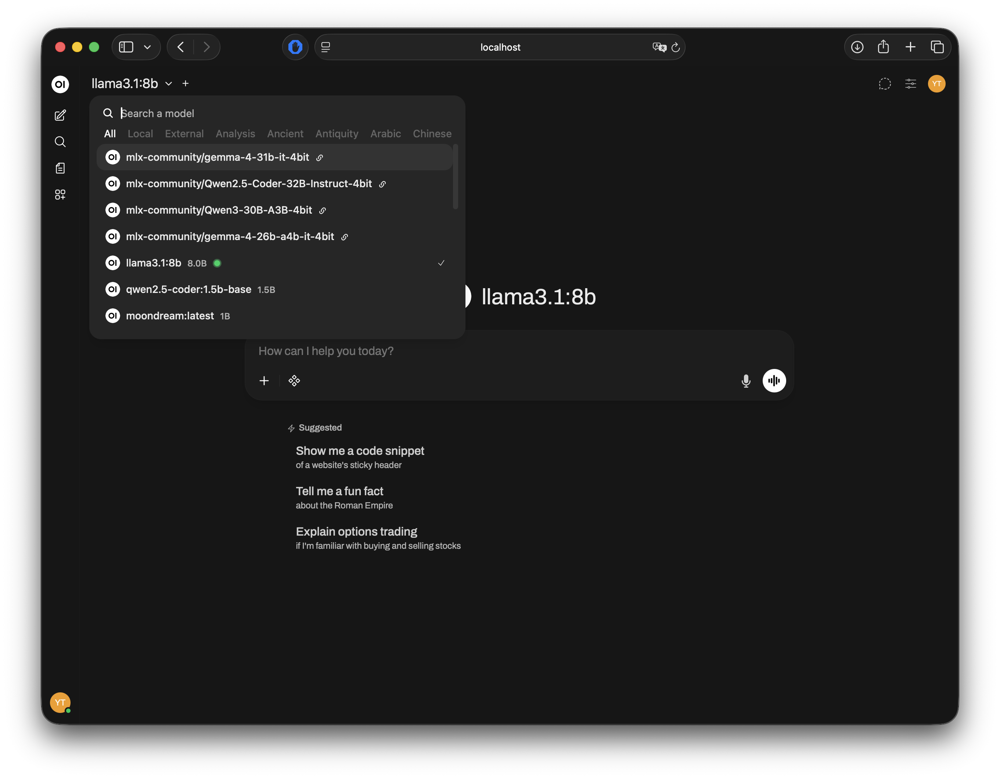
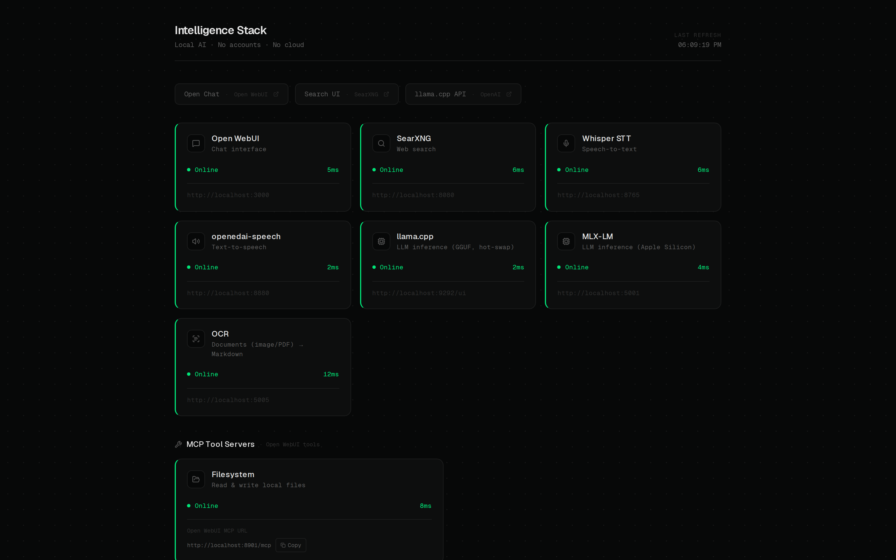
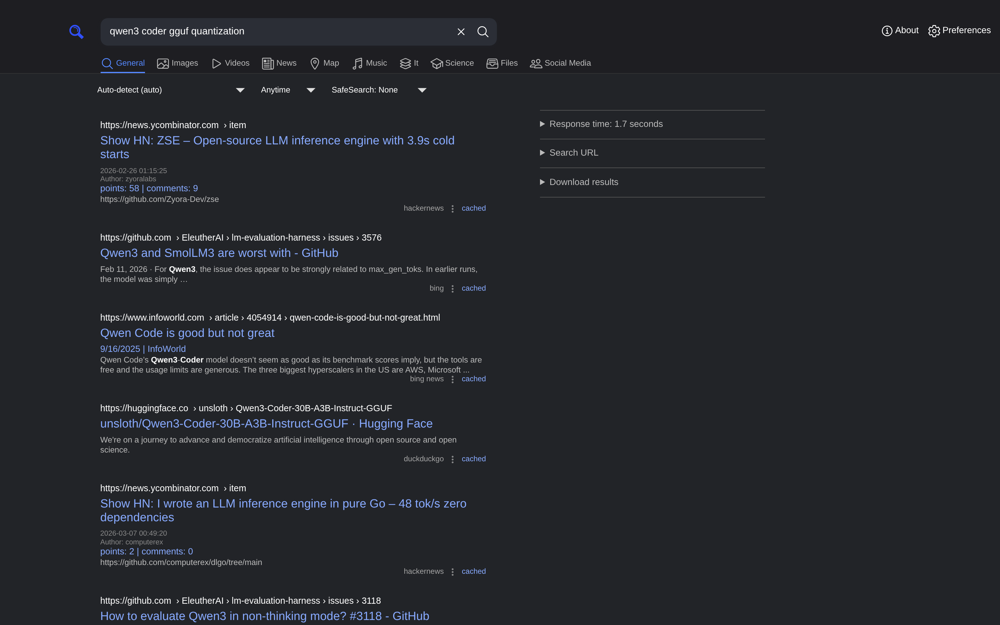
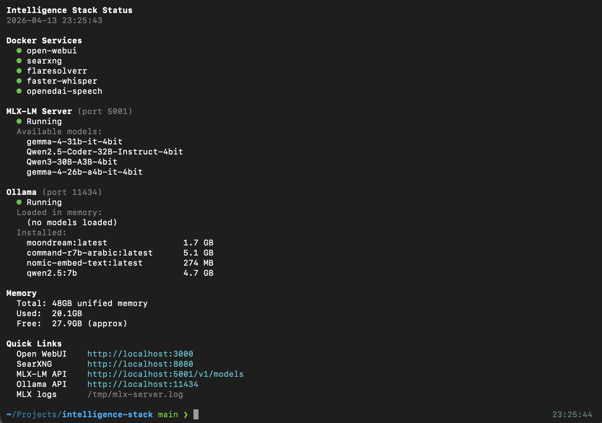

# Intelligence Stack

A fully self-hosted, offline-capable AI stack on Apple Silicon. No accounts, no cloud, no data leaving your machine.

## Prerequisites

- macOS with Apple Silicon (M-series chip)
- [Docker Desktop](https://www.docker.com/products/docker-desktop/)
- **llama.cpp + llama-swap** for GGUF model inference and embeddings:
  ```bash
  brew install llama.cpp                       # llama-server, llama-cli, llama-mtmd-cli
  # llama-swap: the multi-model hot-swap proxy. Prebuilt binary (most reliable):
  #   download llama-swap_<ver>_darwin_arm64.tar.gz from
  #   github.com/mostlygeek/llama-swap/releases, then install the binary to
  #   /opt/homebrew/bin. (Homebrew tap also exists but builds from source.)
  ```
  GGUF models live in `~/models` as `<name>.gguf` (+ `<name>.mmproj.gguf` for
  vision). llama-swap serves them on http://localhost:9292 over the OpenAI API
  and hot-swaps them on demand; what's served is declared in
  `llama-swap/config.yaml`.
- Python 3.13+ with `mlx-lm` installed (`pip install mlx-lm`)

## Setup

```bash
# 1. Copy env file and fill in your secret keys
cp .env.example .env
# Generate keys with: openssl rand -hex 32

# 2. Start Docker services
docker compose up -d

# 3. MLX-LM and llama-swap start automatically via LaunchAgents
#    Manual: ./mlx-server.sh  |  launchctl load ~/Library/LaunchAgents/com.intelligence-stack.llama-swap.plist

# 4. Open http://localhost:3000 and create an admin account

# 5. Check everything
./status.sh
```

The dashboard is at **http://localhost:3001**.

---

## UIs

| Interface | URL | Purpose |
|-----------|-----|---------|
| **Open WebUI** | http://localhost:3000 | Chat, RAG, voice, web search |
| **Dashboard** | http://localhost:3001 | Service health + model browser |
| **SearXNG** | http://localhost:8080 | Search engine (direct access) |
| **Open Terminal** | http://localhost:3000 | Web terminal (via Open WebUI sidebar) |

## Screenshots

| | |
|---|---|
|  |  |
| **Open WebUI** — chat interface with all local models (llama.cpp + MLX) | **Dashboard** — live service health and model browser |
|  |  |
| **SearXNG** — self-hosted metasearch with category tabs | **`./status.sh`** — terminal health check |

---

## Architecture

```
Docker:
  Open WebUI (3000)  ----->  SearXNG (8080)  ----->  FlareSolverr (internal)
       |                         search engine         cloudflare bypass
       |                              |
       |                              +------>  Playwright (internal)
       |                                        JS-rendered page loader
       |
       +--->  Faster-Whisper (8765)    speech-to-text (large-v3-turbo)
       +--->  openedai-speech (8880)   text-to-speech
       +--->  Open Terminal (8888)     web terminal (shell access)

  Dashboard (3001)   health monitor + model browser

Native on host:
  MLX-LM (5001)       Apple Silicon inference (OpenAI-compatible API)
  llama-swap (9292)   llama.cpp GGUF models + embeddings (bge-m3), hot-swapped
                      on demand behind one OpenAI-compatible endpoint

Optional (host-native):
  MCP Filesystem (8901)  file read/write for Open WebUI models
```

## Services

| Service | Purpose | Port |
|---------|---------|------|
| [Open WebUI](https://github.com/open-webui/open-webui) | Chat interface, RAG, tools | 3000 |
| Dashboard | Service health monitor + model browser | 3001 |
| [SearXNG](https://github.com/searxng/searxng) | Self-hosted metasearch (web grounding) | 8080 |
| [FlareSolverr](https://github.com/FlareSolverr/FlareSolverr) | Cloudflare bypass proxy for SearXNG | internal |
| [Faster-Whisper](https://github.com/fedirz/faster-whisper-server) | Local speech-to-text | 8765 |
| [openedai-speech](https://github.com/matatonic/openedai-speech) | Local Piper-based text-to-speech | 8880 |
| [Open Terminal](https://github.com/open-webui/open-terminal) | Web-based terminal with shell access | 8888 |
| [MLX-LM](https://github.com/ml-explore/mlx-lm) | Apple Silicon optimized inference (OpenAI-compatible API) | 5001 |
| [llama.cpp](https://github.com/ggml-org/llama.cpp) + [llama-swap](https://github.com/mostlygeek/llama-swap) | GGUF model inference + embeddings, multi-model hot-swap | 9292 |

---

## Web Search (SearXNG + Open WebUI)

SearXNG is a self-hosted metasearch engine that queries Brave, DuckDuckGo, Google, Bing, and others simultaneously and deduplicates the results. It runs entirely locally — no search query leaves your machine.

Open WebUI is wired directly to SearXNG via its internal Docker network (`searxng:8080`). When web search is active in a chat, Open WebUI sends the user's query to SearXNG's JSON API, injects the returned results into the model's context window, and the model answers with live web grounding.

**To use web search in a chat:**
1. Click the **+** icon in the message input bar
2. Toggle **Web Search** on
3. Ask anything — the model will search before answering and cite its sources

To enable web search by default for all chats: Admin Panel → Settings → Web Search → toggle on.

**Direct SearXNG access** at http://localhost:8080 gives you the full search UI with category tabs (General, Images, Videos, News, Science, Map) — useful for browsing results directly without going through a model.

---

## MLX-LM

MLX-LM runs as a native server on port 5001, providing an OpenAI-compatible API optimized for Apple Silicon. It dynamically swaps models based on the request — only one model is loaded in memory at a time.

Open WebUI connects to it as an OpenAI-compatible backend alongside llama-swap (llama.cpp). Both appear in the model selector — MLX models are prefixed with `mlx-community/`. Models are downloaded on first use and cached in `~/.cache/huggingface/hub/`.

Edit `mlx-server.sh` to change the default model or server options. The LaunchAgent starts the server automatically on login.

### Memory management

Apple Silicon uses unified memory shared between MLX and llama-swap. Large models cannot all run simultaneously. llama-swap unloads idle chat models after 5 minutes (`globalTTL: 300` in `llama-swap/config.yaml`) while keeping the embedding and task models pinned (the `always-on` group, `ttl: 0`). MoE (mixture-of-experts) models use significantly less memory than their parameter count suggests.

---

## Coding agents (Aider / Cline / Continue)

The local model endpoints are OpenAI-compatible, so any coding agent can drive
them — no cloud, no API bills, fully offline. Two endpoints, two strengths:

- **llama-swap** — `http://localhost:9292/v1`, model `qwen3-coder-30b-a3b`
  (Qwen3-Coder 30B-A3B MoE). Tuned for agentic work: native **tool/function
  calling** (`--jinja`) and a **32K** context. Best for tool-driven agents.
- **MLX** — `http://localhost:5001/v1`, model `Qwen2.5-Coder-32B-Instruct-4bit`.
  A strong dense coder; great with diff-based agents like Aider.

**Aider** (CLI, git-native):

```bash
export OPENAI_API_BASE=http://localhost:9292/v1   # or :5001/v1 for the MLX coder
export OPENAI_API_KEY=local                         # any non-empty string
aider --model openai/qwen3-coder-30b-a3b
```

**Cline / Continue** (VS Code): add an *OpenAI-compatible* provider with base
URL `http://localhost:9292/v1`, any API key, model `qwen3-coder-30b-a3b`.

Reality check: a 4-bit 30B coder is genuinely useful for scoped edits,
refactors, and test generation, but trails frontier models on large multi-file
agentic tasks. The pragmatic play is hybrid — local for private/offline/bulk
work, a frontier model for the hard changes.

---

## Configuration

| File | Purpose |
|------|---------|
| `.env` | Secret keys (gitignored) |
| `.env.example` | Template for `.env` |
| `docker-compose.yml` | Docker service definitions |
| `searxng/settings.yml` | SearXNG engines, timeouts, proxy config |
| `mlx-server.sh` | MLX-LM server startup script |
| `llama-swap/config.yaml` | llama.cpp models served + hot-swap/pin policy — the source of truth for what's available on :9292 |
| `bin/llm` | `ollama run`-style CLI (symlinked to `~/.local/bin/llm`) |
| `migrate-ollama-gguf.py`, `verify-models.sh` | One-time Ollama→llama.cpp migration: clone GGUFs out of Ollama's blob store and verify they load |
| `mcp-servers.sh` | MCP tool servers for Open WebUI (optional) |
| `provision-webui.sh` | Registers MCP servers and Open Terminal with Open WebUI |
| `com.intelligence-stack.*.plist` | LaunchAgent templates for mlx-server, llama-swap, mcp-servers, provision-webui, pin-embeddings |
| `status.sh` | Stack health dashboard |
| `pin-embeddings.sh` | Warms `bge-m3` in llama-swap at login (pinning itself is declared in `llama-swap/config.yaml`) |
| `backup.sh` | Snapshots open-webui-data volume + secrets to `~/Documents/intelligence-stack-backups/` |

### Environment variables

| Variable | Purpose |
|----------|---------|
| `WEBUI_SECRET_KEY` | Open WebUI JWT signing key |
| `SEARXNG_SECRET` | SearXNG CSRF protection key |
| `OPEN_TERMINAL_API_KEY` | Bearer key securing the Open Terminal server |

### LaunchAgents (auto-start on login)

| Plist | Purpose |
|-------|---------|
| `~/Library/LaunchAgents/com.intelligence-stack.mlx-server.plist` | MLX-LM server on port 5001 |
| `~/Library/LaunchAgents/com.intelligence-stack.llama-swap.plist` | llama-swap on port 9292 (llama.cpp, flash attention + q8 KV cache) |
| `~/Library/LaunchAgents/com.intelligence-stack.pin-embeddings.plist` | Warms `bge-m3` in llama-swap at login |
| `~/Library/LaunchAgents/com.intelligence-stack.mcp-servers.plist` | MCP filesystem server on port 8901 (optional) |
| `~/Library/LaunchAgents/com.intelligence-stack.provision-webui.plist` | Auto-provisions Open WebUI integrations on login (optional) |

LaunchAgent logs live in `~/Library/Logs/intelligence-stack/` (persists across reboots).

---

## Commands

```bash
# Start/stop Docker services
docker compose up -d
docker compose down

# Stack status (all services, models, memory)
./status.sh

# Restart a single service
docker compose restart open-webui

# Tail logs
docker compose logs open-webui -f

# LaunchAgent logs (mlx, mcp, provision, pin-embeddings)
tail -f ~/Library/Logs/intelligence-stack/mlx-server.log

# Back up Open WebUI data + secrets
./backup.sh --keep 7

# Manually start/stop MLX-LM server
./mlx-server.sh
launchctl unload ~/Library/LaunchAgents/com.intelligence-stack.mlx-server.plist

# Update all Docker images
docker compose pull && docker compose up -d

# Run a model in the terminal (ollama-run style)
llm                       # list models
llm llama3.1-8b "hello"   # one-shot answer (via the shared llama-swap server)
llm qwen2.5-7b            # interactive chat REPL
llm ps                    # which models are loaded in memory

# Restart llama-swap (it also hot-reloads config.yaml via --watch-config)
launchctl kickstart -k gui/$(id -u)/com.intelligence-stack.llama-swap
```

---

## Open Terminal

Open Terminal is a web-based shell that runs inside Docker and connects to Open WebUI. It gives models (and you) a real terminal in the browser.

It starts automatically with `docker compose up -d` and is registered with Open WebUI by `./provision-webui.sh`. No manual setup needed beyond that.

Access it via the **terminal icon** in the Open WebUI sidebar. It is secured with a Bearer key (`OPEN_TERMINAL_API_KEY` in `.env`).

The dashboard shows its live health status and latency.

### Usage examples

**As a user** — click the terminal icon in the Open WebUI sidebar to get a live shell:

```bash
# You're now in a bash session inside the open-terminal container
ls ~/Projects
docker ps
htop
```

**Via a model** — ask the model to run commands for you (requires terminal access enabled for the model):

```
Run `docker ps` and tell me which containers are currently running.
```
```
Check disk usage with df -h and summarise the results.
```
```
List running processes sorted by memory usage.
```

The terminal runs inside Docker but has access to the host via `host.docker.internal`.

---

## MCP Tool Servers (optional)

The filesystem MCP server gives models in Open WebUI the ability to read and write files on your Mac — ~/Documents, ~/Projects, and ~/Downloads. Off by default.

**Prerequisite:** Node.js must be installed (`brew install node`).

### Setup

```bash
# Start the servers (foreground — Ctrl-C stops both)
./mcp-servers.sh

# Then register them in Open WebUI (auto-detects running servers)
./provision-webui.sh

# Auto-start servers + auto-provision on every login
cp com.intelligence-stack.mcp-servers.plist ~/Library/LaunchAgents/
cp com.intelligence-stack.provision-webui.plist ~/Library/LaunchAgents/
launchctl load ~/Library/LaunchAgents/com.intelligence-stack.mcp-servers.plist
launchctl load ~/Library/LaunchAgents/com.intelligence-stack.provision-webui.plist
```

The provision LaunchAgent re-registers the integrations every time you log in. This ensures they come back automatically after Open WebUI updates or container recreations, which can wipe the stored config.

After provisioning, activate the tools for a model: **Workspace → Models → (select model) → Tools → enable Filesystem**.

The dashboard (http://localhost:3001) shows live MCP server status and has copy buttons for the SSE URLs.

### Usage examples

```
Read ~/Projects/my-app/main.py and explain what it does.
```
```
List the markdown files in ~/Documents/notes.
```
```
Write a summary of our conversation to ~/Documents/ai-session.md.
```
